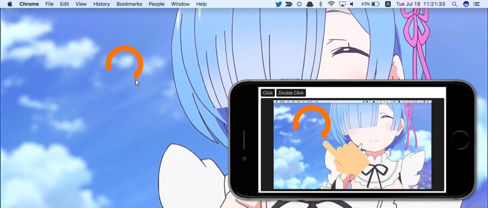

# Mona

Another Cursor (a homework of コンピュータグラフィックス特論).



## Requirements

My environment is as below.

* Electron v1.6.11
* yarn v0.27.5
* Node.js v7.9.0
* macOS Sierra v10.12.5

## Setup => Run

```zsh
# Setup
git clone https://github.com/mimorisuzuko/mona
cd mona
yarn
cd client
yarn

# Run in /mona
yarn start

# Open in your smartphone
open http://localhost:3000
```